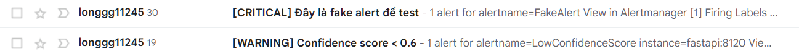

# **MLOPS-Lab3**
# 🔍 API Giám sát và Ghi log

Dự án này cung cấp một API dự đoán nên mua/bán dựa trên giá Bicoin theo thời gian thực.

Lab 3 này hướng dẫn cách thiết lập hệ thống giám sát và ghi log cho API học máy, sử dụng **Prometheus**, **Grafana**, **Loki**, ...

## 👥 Thành viên nhóm

Dự án thuộc môn học **MLOPS (CS317.P22)** với các thành viên:

- Nguyễn Đức Minh Mẫn — 22520844  
- Hứa Tấn Sang — 22521239  
- Phạm Đình Anh Duy — 22520337  
- Hoàng Minh Long — 22520809

## ⚙️ Yêu cầu hệ thống

- Python 3.10 trở lên  
- Thư viện: `ultralytics` (YOLOv8)  
- Docker & Docker Compose  
- FastAPI  
- Prometheus  
- Grafana  
- Node Exporter  
- Loki 
- Alertmanager (tuỳ chọn)

## 🚀 Cài đặt và sử dụng

### 1. Clone dự án

```bash
git clone https://github.com/llogn11245/Lab03-MLOPS
cd Lab03-MLOPS
```

### 2. Cài Docker và Docker Compose

**Trên Ubuntu:**
```bash
sudo apt update
sudo apt install docker.io docker-compose -y
sudo systemctl enable docker
sudo systemctl start docker
```

**Trên macOS / Windows:**  
Tải Docker Desktop tại: https://www.docker.com/products/docker-desktop

**Kiểm tra phiên bản:**
```bash
docker --version
docker compose version
```

### 3. Mở các cổng mặc định

| Dịch vụ         | Cổng  |
|------------------|-------|
| Prometheus       | 9090  |
| Node Exporter    | 9100  |
| Grafana          | 3000  |
| Loki       | 3100  |
| Alertmanager     | 9093  |
| FastAPI (API)    | 8070  |

Đảm bảo các cổng này không bị chặn trên máy bạn.

### 4. Khởi động dịch vụ

```bash
docker compose up -d
```

Dịch vụ bao gồm:
- Prometheus: Thu thập metrics
- Node Exporter: Giám sát hệ thống
- Grafana: Dashboard trực quan
- Loki: Logging service
- Alertmanager: Cảnh báo (tuỳ chọn)
- FastAPI App: API dự đoán nên mua/bán dựa trên giá Bicoin theo thời gian thực.

### 5. Truy cập các dịch vụ

| Dịch vụ       | URL                         |
|---------------|-----------------------------|
| FastAPI App   | http://localhost:8120      |
| Prometheus    | http://localhost:9090       |
| Grafana       | http://localhost:3000       |
| Loki    | http://localhost:3100       |
| Alertmanager  | http://localhost:9093       |

**Thông tin đăng nhập Grafana (mặc định):**
- Tên: `admin`
- Mật khẩu: `admin` (nên đổi sau lần đầu)

### 6. Nhập Dashboard vào Grafana (nếu có)

- Vào Grafana → Dashboards → New → Import
- Tải file JSON dashboard từ file grafana/dashboard.json hoặc sử dụng cấu hình có sẵn.
- Chọn đúng **Data Source** (Prometheus & Loki)

### **LƯU Ý:**

Để có thể sử dụng được tính năng alert, bạn phải thay đổi email trong file alertmanager.yaml theo email của bạn. 

```bash
smtp_smarthost: 'smtp.gmail.com:587'
smtp_from: 'email mà bạn dùng để gửi aler'
smtp_auth_username: 'email mà bạn dùng để gửi aler'
smtp_auth_password: 'app password của tài khoản email trên'     
smtp_require_tls: true
```
```bash
receivers:
  - name: email-warning
    email_configs:
      - to: 'email bạn muốn nhận alert'
        send_resolved: true
        headers:
          subject: '[WARNING] {{ .CommonAnnotations.summary }}'

  - name: email-critical
    email_configs:
      - to: 'email bạn muốn nhận alert'
        send_resolved: true
        headers:
          subject: '[CRITICAL] {{ .CommonAnnotations.summary }}'
```
**App Password được tạo theo hướng dẫn sau: https://support.google.com/accounts/answer/185833?hl=en**

Sau khi hoàn tất các bước setup alertmanager bạn sẽ nhận được các mail warning và critical theo rules đã được đề ra. 



## 📺 Demo

### ✅ Giám sát hoạt động bình thường

- Dashboard cập nhật theo thời gian thực
- Giám sát lưu lượng truy cập API
- Hiển thị CPU, RAM, lỗi và log


---

### ⚠️ Mô phỏng lỗi API

- Tạo lỗi trong API
- Log lỗi được ghi nhận
- Grafana hiển thị tỷ lệ lỗi tăng cao

